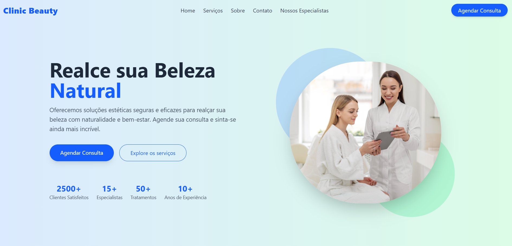

# Clinic Beauty

Landing Page fictícia desenvolvida para uma clínica de estética, com foco em apresentar os serviços, profissionais e formas de contato de maneira moderna e responsiva.

##  Visão Geral

Este projeto tem como objetivo simular uma landing page profissional de uma clínica de estética. Criado como exercício prático de front-end, a interface foi construída utilizando **Vue.js** e estilizada com **Tailwind CSS**.

##  Prévia

## Tecnologias Utilizadas

- [Vue.js](https://vuejs.org/) – Framework progressivo para construção de interfaces
- [Vite](https://vitejs.dev/) – Ferramenta moderna de build para projetos Vue
- [Tailwind CSS](https://tailwindcss.com/) – Framework utilitário de CSS
- HTML5 e CSS3

## Como Executar Localmente

1. **Clone o repositório**

git clone https://github.com/carlosqbarbosa/ClinicBeauty.git

2. **Acesse o diretório do projeto**

cd ClinicBeauty

3. **Instale as dependências**
npm install

4. **Rode o projeto**
npm run dev

5. **Abra o navegador**

Acesse: http://localhost:5173

## Funcionalidades
- Página inicial com destaque visual (Hero)
- Seção "Sobre a Clínica"
- Lista de serviços oferecidos
- Galeria com especialistas
- Seção de contato e rodapé

## Design
O projeto adota uma paleta suave e estética moderna, com imagens ilustrativas, tipografia elegante e responsiva para diferentes dispositivos.

## Status
Projeto finalizado para fins de estudo.
Aberto para melhorias e sugestões.
